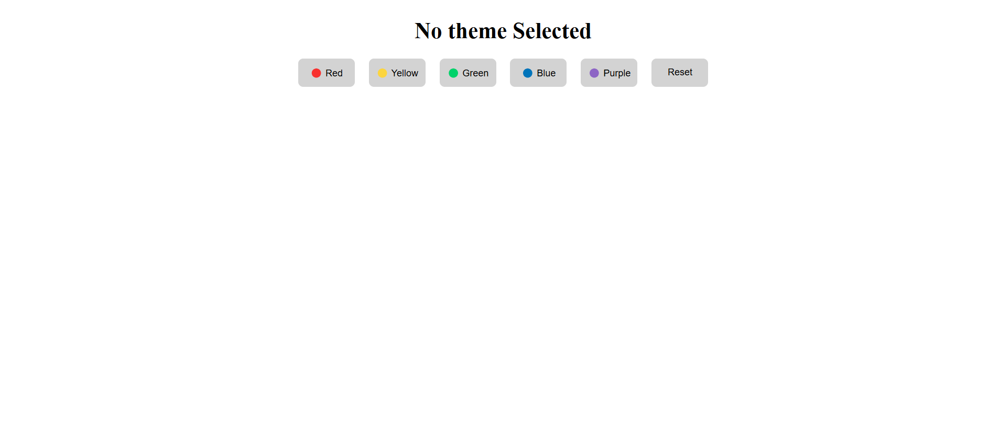
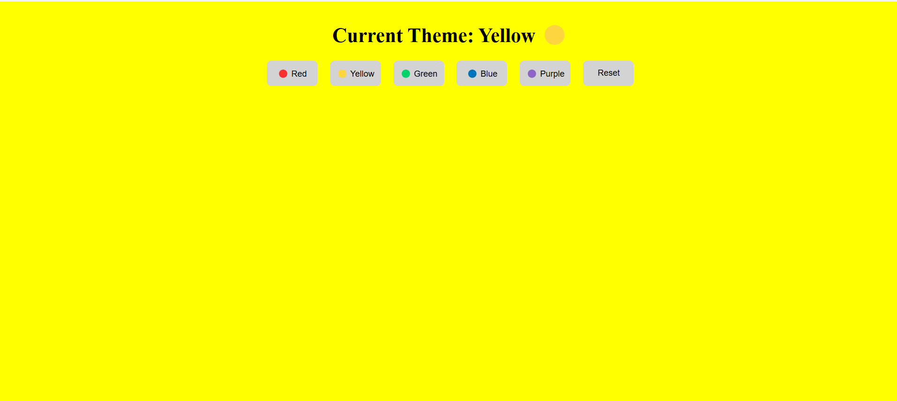
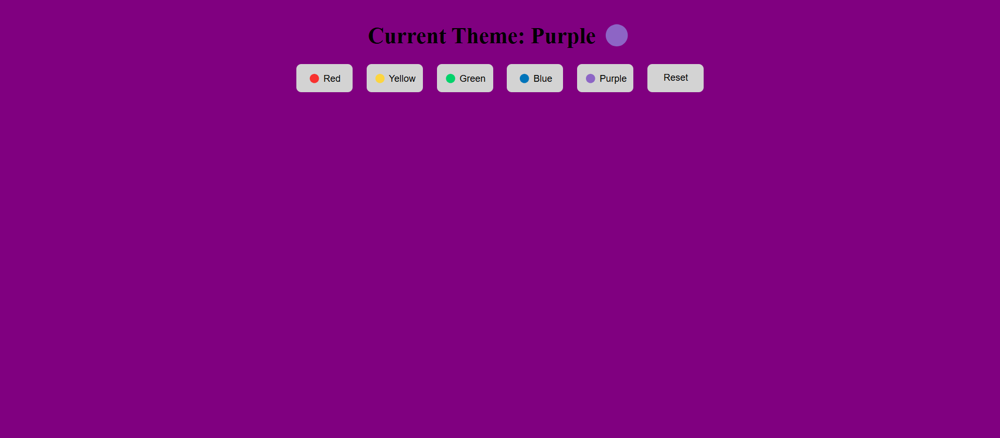

# 🎨 Background Color Changer (Vanilla JS)

A simple and interactive JavaScript project that allows users to change the background color of the webpage using buttons.

---

## 🌐 Live Demo
[Click here to view](https://your-link.com)

---

## 🚀 Features

* 🎯 Change background color with a single click
* 🎨 Multiple color themes
* 🔄 Reset to default theme
* ⚡ Smooth transition effect
* 🧠 Built using pure JavaScript (no frameworks)

---

## 🛠️ Tech Stack

* 🌐 HTML5
* 🎨 CSS3
* 📜 JavaScript (DOM Manipulation)

---

## 📂 Folder Structure

```
project-folder/
│
├── index.html
├── index.css
├── index.js
├── screenshots/
│  └── img1.png
│  └── img2.png
│  └── img3.png
│
└── README.md
```

---
## 📸 Screenshots

### 🏠 Default Screen


### 🟡 Yellow Theme


### 🟣 Purple Theme



## ⚙️ How to Run

1. Download or clone the repository:

```
git clone  https://github.com/Ayesha-Saddique9/bg-color-changer 
```

2. Open the project folder

3. Run `index.html` in your browser

---

## 📖 What I Learned

* DOM Selection (`getElementById`)
* Event Handling (`addEventListener`)
* Dynamic Styling using JavaScript
* Updating UI using `textContent`

---

## 🌟 Future Improvements

* 🔁 Refactor code using loops or array mapping
* 🎨 Add more color options
* 💾 Save selected theme using localStorage
* 📱 Improve responsiveness

---

## 🤝 Contributing

Suggestions and improvements are welcome!

---

## 📜 License

Free to use for learning purposes.

---

## 👩‍💻 Author
Made with ❤️ by Ayesha
